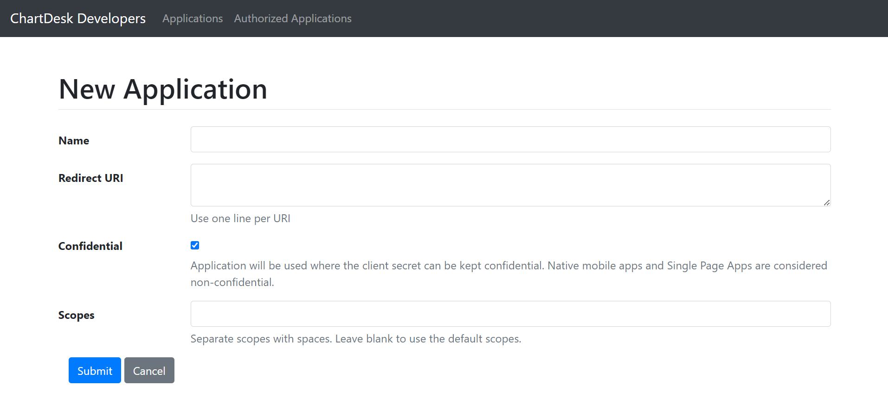
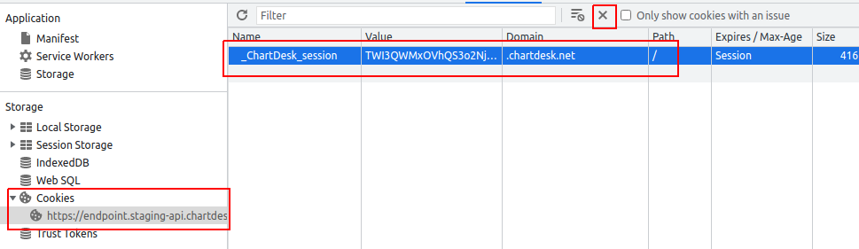
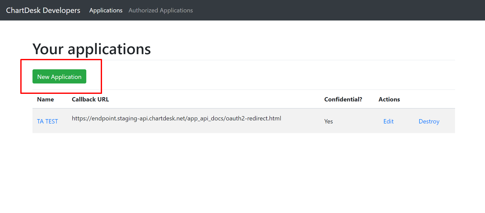
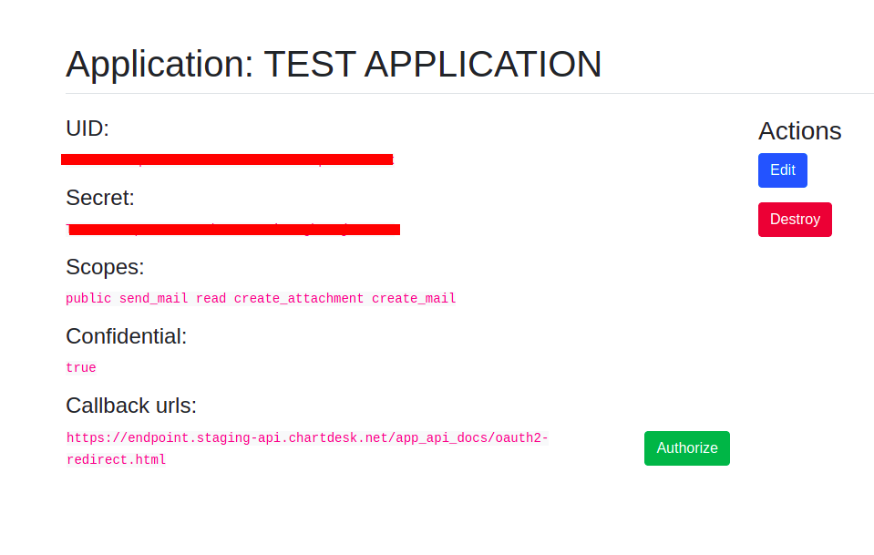
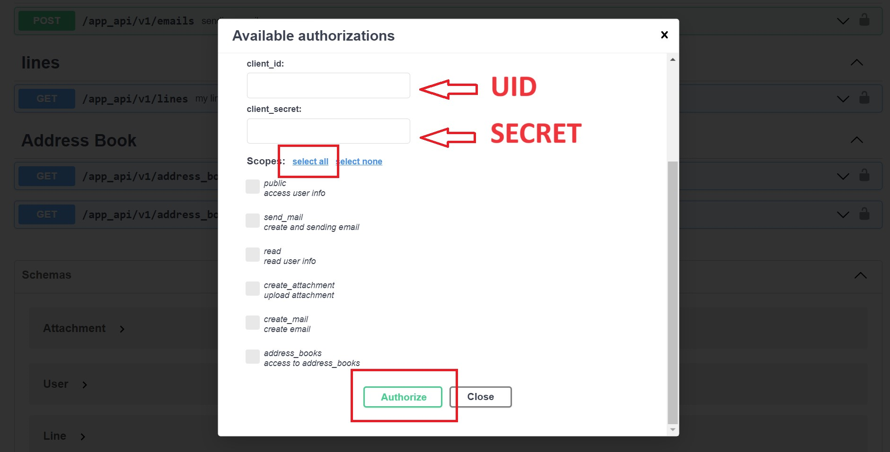

# How To Create An Application On MT Inbox (ChartDesk)

## How To Create An App

**Step 1:** The user needs to have a ChartDesk (CD) account. Kindly note that only an `admin account` can create an application on ChartDesk.

**Step 2:** Login to:

  1. Staging:
  ```
  https://endpoint.staging-api.chartdesk.net/users/sign_in
  ```

  2. Production SG:

  ```
  https://endpoint.prod-api.chartdesk.net/users/sign_in
  ```

  3. Production DE:

  ```
  https://endpoint.prod-api.chartdesk.de/users/sign_in
  ```

**Step 3:** Click on “New Application”

  

**Step 4:** Fill in the required information

  

  - Application Name

  - Redirect URL:

  ```
  https://endpoint.staging-api.chartdesk.net/app_api_docs/oauth2-redirect.html
  ```

  - Scopes

  ```
  public (default)
  send_mail
  read
  create_attachment
  create_mail
  address_books
  ```

**Step 5:** You will find a screen of the created application  details with UID, Secret, and Scopes.



## How To Test An API Call

**Step 1:** Create an application on CD as instructed above and update the CallBack URL to: https://endpoint.staging-api.chartdesk.net/app_api_docs/oauth2-redirect.html

**Step 2:** Go to [https://endpoint.staging-api.chartdesk.net/app_api_docs/index.html](https://endpoint.staging-api.chartdesk.net/app_api_docs/index.html)

**Step 3:** Click on “Authorize”, fill in the client_id (UID), client_secret (Secret) that you received on the Application Created page, and click on “select all” in Scopes.



**Step 4:** Click on `Authorize` to test the API call

- Instruction Video


## Common Issues

**DO NOT** automatically log in and redirect to: [https://endpoint.staging-api.chartdesk.net/users/sign_in](https://endpoint.staging-api.chartdesk.net/users/sign_in)


1. Users need to make sure to remove the cookies and close this page
2. Then login to [https://staging.chartdesk.pro/#/login](https://staging.chartdesk.pro/#/login) to reopen [https://endpoint.staging-api.chartdesk.net/users/sign_in](https://endpoint.staging-api.chartdesk.net/users/sign_in)



# API Usage Guide

To test or try out the APIs, you can get access to [this page](https://endpoint.staging-api.chartdesk.net/app_api_docs/index.html)

After that, the following guide will provide detailed instructions for using the API endpoints in your application.


## 1. Create Attachments

- Endpoint: `/app_api/v1/attachments`
- Method: `POST`
- Scope: `create_attachment`
- Request Body:
  * `file`: File data (Supports JPG, PNG, PDF, Text)
  * `disposition`: String, one of the following values:
    * `attachment`: The file attached to the email
    * `inline`: File embedded within the email content
    * `link`: File linked as a URL

- Response Example:

  - `status_code`: `201`

  ```
  {
    "id": 0,
    "original_file_url": "string",
    "name": "string",
    "disposition": "link"
  }
  ```

## 2. Get User Information


- Endpoint: `/app_api/v1/me`
- Method: `GET`
- Scope: `public`, `read`
- Response Example:
  - `status_code`: `200`

    ```
    {
      "id": 0,
      "avatar": "string",
      "name": "string",
      "departments": "string",
      "user_name": "string"
    }
    ```

## 3. Get Mailbox Information
- Endpoint: `/app_api/v1/lines`
- Method: `GET`
- Scope: `public`, `read`
- Response Example:
  - `status_code`: `200`

    ```
    [
      {
        "id": 1,
        "email": "hello@chartdesk.pro",
        "can_send": true
      }
    ]
    ```

## 4. Send Email
- Endpoint: `/app_api/v1/emails`
- Method: `POST`
- Scope: `send_mail`, `create_mail`
- Request Params:
  - from: Sender’s email address (string)
  - body_type: Type of email body (`html` or `plain_text`)
  - body: Email content (string)
  - to: Array of recipient email addresses (object)
  - cc: Array of CC email addresses (object)
  - action: One of the following actions: `['normal', 'reply', 'forward', 'replyall']` (string)
  - attachments: List of attachment IDs (array of integers), IDs are obtained from (1), only attach the IDs of attachment_type “attachment” and “inline”.

- Request Example:

  ```
  {
    "from": "hello@chartdesk.pro",
    "body_type": "html",
    "body": "Hi there",
    "to": {
      "emails": [
        "your_email@email.com"
      ]
    },
    "cc": {
      "emails": [
        "your_cc@email.com"
      ]
    },
    "action": "normal",
    "attachments": [
      1,
      2
    ]
  }
  ```

- Response Example:

  - `status_code`: `200`

    ```
    {
      "message": "created"
    }
    ```

If you want to create an email with inline attachments, please follow the below steps:

-  Step 1: Upload the attachment as an inline attachment.
-  Step 2: Create the email with the body including the image tag as follows:

```
  
```

For example, if the uploaded attachment returns an ID of 1, the params to send for creating the email would be as follows:


```
{
  "from": "hello@chartdesk.pro",
  "body_type": "html",
  "subject": "email with attachments",
  "body": "",
  "to": {
    "emails": [
      "your_emai@email.com"
    ]
  },
  "cc": {
    "emails": [
      "your_cc@email.com"
    ]
  },
  "action": "normal",
  "attachments": [
    1
  ]
}
```


## 5. Display Address Book

- Endpoint: `/app_api/v1/address_books`
- Method: `GET`
- Scope: `address_books`
- Request Params:
  - page: Page number (integer)
  - per_page: Number of records per page (integer)

- Response Example:

  - `status_code`: `200`

    ```
    [
      {
        "id": 1,
        "contact_type": "contact",
        "name": "chartdesk",
        "salutation": "hellooooooo babey",
        "job_title": "this is job_title",
        "email_address_work_1": "email_address_work_1@chartdesk.pro",
        "email_address_work_2": "email_address_work_2@chartdesk.pro",
        "email_address_work_3": "email_address_work_3@chartdesk.pro",
        "email_address_personal_1": "email_address_personal_1@chartdesk.pro",
        "email_address_personal_2": "email_address_personal_2@chartdesk.pro",
        "email_address_personal_3": "email_address_personal_3@chartdesk.pro",
        "email_address_other_1": "email_address_other_1@chartdesk.pro",
        "email_address_other_2": "email_address_other_2@chartdesk.pro",
        "email_address_other_3": "email_address_other_3@chartdesk.pro",
        "phone_mobile_1": "+380 48 7165731",
        "phone_mobile_2": "+380 48 7165732",
        "phone_mobile_3": "+380 48 7165733",
        "phone_office_1": "+380 48 716573",
        "phone_office_2": "+380 48 7165732",
        "phone_office_3": "+380 48 7165733",
        "phone_fax_1": "+380 48 7165731",
        "phone_fax_2": "+380 48 7165732",
        "phone_fax_3": "+380 48 7165733",
        "phone_other_1": "+380 48 7165731",
        "phone_other_2": "+380 48 7165732",
        "phone_other_3": "+380 48 7165733",
        "im": "string",
        "company": 0,
        "department": 0,
        "post_address": "1, Leytenanta Shmidta Street UA-65012 Odessa",
        "city": "string",
        "state": "string",
        "country": "VietNam",
        "web_url": "https://chartdesk.pro/",
        "notes": "First note Second note"
      }
    ]
    ```


## 6. Display Detailed Address Book By ID

- Endpoint: `/app_api/v1/address_books/:id`
- Method: `GET`
- Scope: `address_books`
- Response Example:

  - status_code: 200

    ```
    {
      "id": 1,
      "contact_type": "contact",
      "name": "chartdesk",
      "salutation": "hellooooooo babey",
      "job_title": "this is job_title",
      "email_address_work_1": "email_address_work_1@chartdesk.pro",
      "email_address_work_2": "email_address_work_2@chartdesk.pro",
      "email_address_work_3": "email_address_work_3@chartdesk.pro",
      "email_address_personal_1": "email_address_personal_1@chartdesk.pro",
      "email_address_personal_2": "email_address_personal_2@chartdesk.pro",
      "email_address_personal_3": "email_address_personal_3@chartdesk.pro",
      "email_address_other_1": "email_address_other_1@chartdesk.pro",
      "email_address_other_2": "email_address_other_2@chartdesk.pro",
      "email_address_other_3": "email_address_other_3@chartdesk.pro",
      "phone_mobile_1": "+380 48 7165731",
      "phone_mobile_2": "+380 48 7165732",
      "phone_mobile_3": "+380 48 7165733",
      "phone_office_1": "+380 48 716573",
      "phone_office_2": "+380 48 7165732",
      "phone_office_3": "+380 48 7165733",
      "phone_fax_1": "+380 48 7165731",
      "phone_fax_2": "+380 48 7165732",
      "phone_fax_3": "+380 48 7165733",
      "phone_other_1": "+380 48 7165731",
      "phone_other_2": "+380 48 7165732",
      "phone_other_3": "+380 48 7165733",
      "im": "string",
      "company": 0,
      "department": 0,
      "post_address": "1, Leytenanta Shmidta Street UA-65012 Odessa",
      "city": "string",
      "state": "string",
      "country": "VietNam",
      "web_url": "https://chartdesk.pro/",
      "notes": "First note Second note"
    }
    ```
